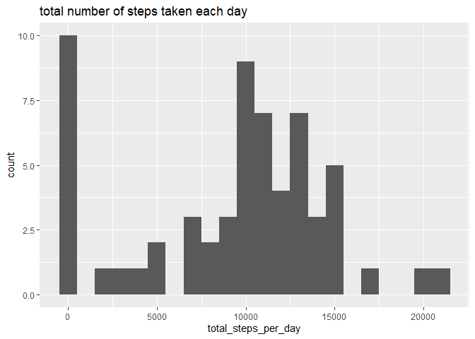
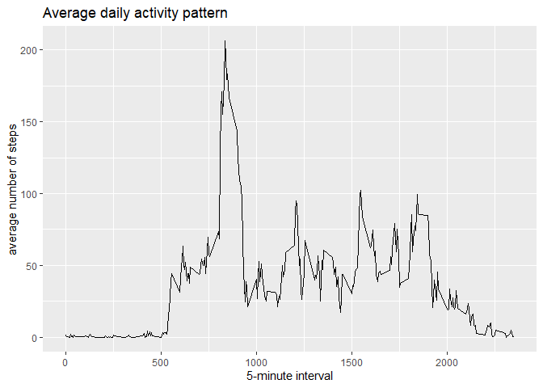
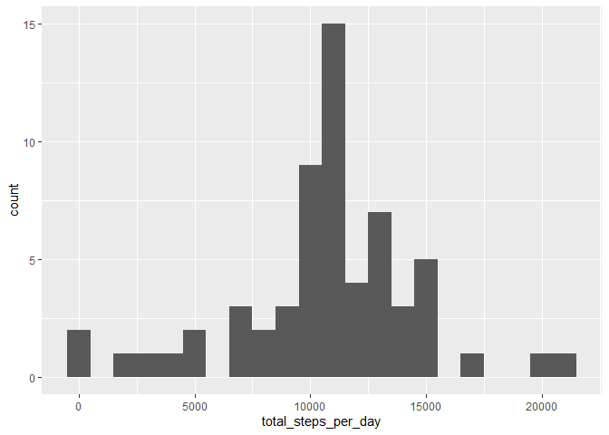
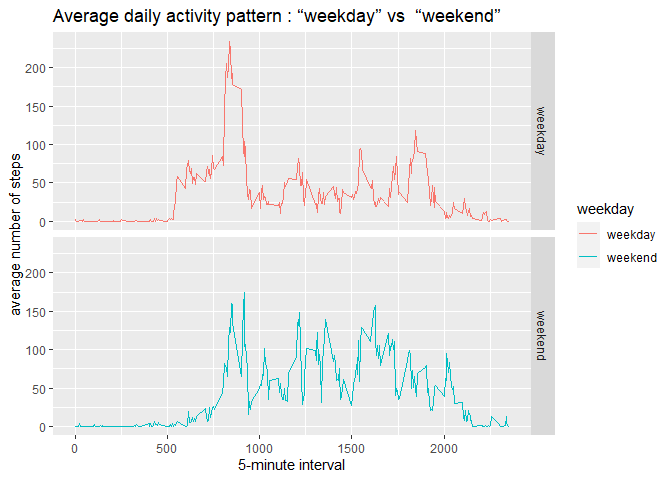

## Loading and preprocessing the data

1. Load packages  

```r
library(ggplot2)
library(Hmisc)
```

```
## Loading required package: lattice
```

```
## Loading required package: survival
```

```
## Loading required package: Formula
```

```
## 
## Attaching package: 'Hmisc'
```

```
## The following objects are masked from 'package:base':
## 
##     format.pval, units
```

```r
library(dplyr)
```

```
## 
## Attaching package: 'dplyr'
```

```
## The following objects are masked from 'package:Hmisc':
## 
##     src, summarize
```

```
## The following objects are masked from 'package:stats':
## 
##     filter, lag
```

```
## The following objects are masked from 'package:base':
## 
##     intersect, setdiff, setequal, union
```

2. Download file and unzip  

```r
wd <- getwd()
download.file("https://d396qusza40orc.cloudfront.net/repdata%2Fdata%2Factivity.zip", destfile = paste0(wd,"/activity.zip"))
unzip("activity.zip")
```

3. load the 'activity.csv' file  

```r
activity <- read.csv("activity.csv")
```


## What is mean total number of steps taken per day?
1. total number of steps taken per day  

```r
activity %>% group_by(date) %>% 
  summarise(total_steps_per_day = sum(steps, na.rm = TRUE))
```

```
## `summarise()` ungrouping output (override with `.groups` argument)
```

```
## # A tibble: 61 x 2
##    date       total_steps_per_day
##    <chr>                    <int>
##  1 2012-10-01                   0
##  2 2012-10-02                 126
##  3 2012-10-03               11352
##  4 2012-10-04               12116
##  5 2012-10-05               13294
##  6 2012-10-06               15420
##  7 2012-10-07               11015
##  8 2012-10-08                   0
##  9 2012-10-09               12811
## 10 2012-10-10                9900
## # ... with 51 more rows
```
  
2. histogram of the total number of steps taken each day  

```r
activity %>% group_by(date) %>% 
  summarise(total_steps_per_day = sum(steps, na.rm = TRUE)) %>% 
  ggplot(aes(total_steps_per_day))+
  geom_histogram(binwidth = 1000)
```

```
## `summarise()` ungrouping output (override with `.groups` argument)
```

<!-- -->


```r
activity_step <- activity %>% group_by(date) %>% 
  summarise(total_steps_per_day = sum(steps, na.rm = TRUE))
```

```
## `summarise()` ungrouping output (override with `.groups` argument)
```

```r
hist(activity_step$total_steps_per_day)  
```

<!-- -->

  
3. mean and median of the total number of steps taken per day

```r
activity %>% group_by(date) %>% 
  summarise(total_steps_per_day = sum(steps, na.rm = TRUE)) %>% 
  summarise(mean_total_steps_per_day = mean(total_steps_per_day))
```

```
## `summarise()` ungrouping output (override with `.groups` argument)
```

```
## # A tibble: 1 x 1
##   mean_total_steps_per_day
##                      <dbl>
## 1                    9354.
```

```r
activity %>% group_by(date) %>% 
  summarise(total_steps_per_day = sum(steps, na.rm = TRUE)) %>% 
  summarise(median_total_steps_per_day = median(total_steps_per_day))
```

```
## `summarise()` ungrouping output (override with `.groups` argument)
```

```
## # A tibble: 1 x 1
##   median_total_steps_per_day
##                        <int>
## 1                      10395
```
  


## What is the average daily activity pattern?  

1. time series plot  

```r
activity %>% group_by(interval) %>% 
  summarise(avg_step = mean(steps, na.rm = TRUE)) %>% 
  ggplot(aes(x = interval, y = avg_step))+
  geom_line()+
  labs(x = "5-minute interval", y = "average number of steps", title = "Average daily activity pattern")
```

```
## `summarise()` ungrouping output (override with `.groups` argument)
```

<!-- -->

2. 5-minute interval contains the maximum number of steps

```r
activity %>% group_by(interval) %>% 
  summarise(avg_step = mean(steps, na.rm = TRUE)) %>% 
  arrange(desc(avg_step)) %>% 
  head(1)
```

```
## `summarise()` ungrouping output (override with `.groups` argument)
```

```
## # A tibble: 1 x 2
##   interval avg_step
##      <int>    <dbl>
## 1      835     206.
```


## Imputing missing values

1. total number of missing values

```r
summary(activity)
```

```
##      steps            date              interval     
##  Min.   :  0.00   Length:17568       Min.   :   0.0  
##  1st Qu.:  0.00   Class :character   1st Qu.: 588.8  
##  Median :  0.00   Mode  :character   Median :1177.5  
##  Mean   : 37.38                      Mean   :1177.5  
##  3rd Qu.: 12.00                      3rd Qu.:1766.2  
##  Max.   :806.00                      Max.   :2355.0  
##  NA's   :2304
```

```r
activity %>% filter(is.na(steps)) %>% count()
```

```
##      n
## 1 2304
```

2. filling in all of the missing values with mean

```r
activity$steps_impute <- impute(activity$steps, fun=mean)
```

3. histogram of the total number of steps taken each day

```r
activity %>% group_by(date) %>% 
  summarise(total_steps_per_day = sum(steps_impute, na.rm = TRUE)) %>% 
  ggplot(aes(total_steps_per_day))+
  geom_histogram(binwidth = 1000)
```

```
## `summarise()` ungrouping output (override with `.groups` argument)
```

<!-- -->

mean and median  

```r
activity %>% group_by(date) %>% 
  summarise(total_steps_per_day = sum(steps_impute, na.rm = TRUE)) %>% 
  summarise(mean_total_steps_per_day = mean(total_steps_per_day))
```

```
## `summarise()` ungrouping output (override with `.groups` argument)
```

```
## # A tibble: 1 x 1
##   mean_total_steps_per_day
##                      <dbl>
## 1                   10766.
```

```r
activity %>% group_by(date) %>% 
  summarise(total_steps_per_day = sum(steps_impute, na.rm = TRUE)) %>% 
  summarise(median_total_steps_per_day = median(total_steps_per_day))
```

```
## `summarise()` ungrouping output (override with `.groups` argument)
```

```
## # A tibble: 1 x 1
##   median_total_steps_per_day
##                        <dbl>
## 1                     10766.
```


## Are there differences in activity patterns between weekdays and weekends?

1. new factor variable – “weekday” and “weekend”  

```r
Sys.setlocale("LC_TIME", "English")
```

```
## [1] "English_United States.1252"
```

```r
activity_week <- activity %>% mutate(days = weekdays(as.Date(date)),
                    weekday = ifelse(days %in% c("Sunday", "Saturday"), "weekend", "weekday"))
```

2. time series plot – “weekday” and “weekend” 

```r
activity_week %>% group_by(weekday,interval) %>% 
  summarise(avg_step = mean(steps, na.rm = TRUE)) %>% 
  ggplot(aes(x = interval, y = avg_step, color = weekday))+
  geom_line()+
  labs(x = "5-minute interval", y = "average number of steps", 
       title = "Average daily activity pattern : “weekday” vs  “weekend”")+
  facet_grid(weekday ~.)
```

```
## `summarise()` regrouping output by 'weekday' (override with `.groups` argument)
```

<!-- -->

